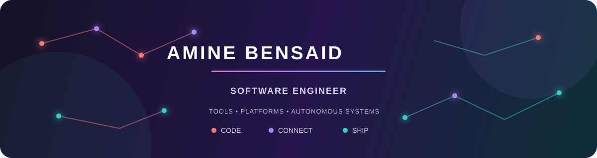

 

I turn complex systems into tools people can understand and products they can rely on.

## My engineering map

<table>
<tr>
<td align="center" width="25%">
<h3>🧭 Developer Tools</h3>
Static analysis Architecture visualization Editor extensions
</td>
<td align="center" width="25%">
<h3>🪄 Full-Stack</h3>
Product workflows Backend architecture Data & media systems
</td>
<td align="center" width="25%">
<h3>🤖 Robotics</h3>
Autonomous navigation Distributed ROS 2 Control & perception
</td>
<td align="center" width="25%">
<h3>⚡ Embedded & IoT</h3>
Real-time firmware Device communication Cloud telemetry
</td>
</tr>
</table>

I study **Embedded Systems Engineering at INSAT, Tunisia**. The projects I enjoy most cross several boxes in this map: a source analyzer that becomes a VS Code experience, a web platform with real operational workflows, or an autonomous robot whose software spans Linux, ROS 2, and microcontrollers.

## Project atlas

<table>
<tr>
<td colspan="2" valign="top">

### 🪐 ROS 2 Inspector Ecosystem

OPEN SOURCE · CREATOR & MAINTAINER

Static architecture analysis and developer tooling for ROS 2 workspaces. The core CLI discovers packages, nodes, deployments, topics, services, actions, and interfaces from Python, C++, and launch files—without executing the workspace. It produces architecture graphs, diagnostics, audits, and CI-enforceable policy results.

The companion VS Code extension brings the same architecture model into the editor through a searchable explorer, interactive graphs, Problems integration, policy validation, and direct source navigation.

`Python` `Tree-sitter` `NetworkX` `Typer` `Pytest` `VS Code API` `Webviews`

[**Core CLI ↗**](https://github.com/aminebensaid66/ros2_inspector) &nbsp; [**VS Code extension ↗**](https://github.com/aminebensaid66/ros2_inspector_vscode) &nbsp; [Documentation ↗](https://ros2-inspector-theta.vercel.app/) &nbsp; [PyPI ↗](https://pypi.org/project/ros2inspector/)

</td>
</tr>
<tr>
<td width="50%" valign="top">

### 🧶 TRI-UP Platform

PRIVATE ORGANIZATION PROJECT · FULL-STACK DEVELOPER

E-learning, production-matching, and logistics for artisan associations. I worked across matching, concurrent order flows, secure media delivery, authentication, performance, UI reliability, and automated testing.

`Next.js` `NestJS` `PostgreSQL` `Prisma` `Redis` `MinIO/R2`

</td>
<td width="50%" valign="top">

### 🦾 EUROBOT 2026

AEROBOTIX INSAT · ROS 2 DEVELOPER

Distributed autonomous robot stack combining Hybrid A* navigation, lidar perception, task coordination, micro-ROS embedded communication, and a live operations dashboard.

`ROS 2` `Python` `C++` `micro-ROS` `STM32` `ESP32`

🥇 Tunisia &nbsp;·&nbsp; 🥈 Accumulation phase &nbsp;·&nbsp; **Top 5 worldwide**

[**Team organization ↗**](https://github.com/Eurobot-2026-Aerobotix) &nbsp; [Robot demo ↗](https://www.youtube.com/watch?v=EC6gGIbOj7o&list=PLNhKoU2ZKSAGotMFKrfqBCY1hgt4LfQE8)

</td>
</tr>
<tr>
<td width="50%" valign="top">

### 🏎️ NXP Cup Autonomous Car

EMBEDDED & CONTROL DEVELOPER

Real-time lane following with Pixy2 vision, encoder feedback, and PID motor control on a Teensy 4, supported by ESP32-based hardware testing tools.

`Embedded C++` `PID` `Teensy 4` `Pixy2` `ESP32`

🥇 **1st in Tunisia** &nbsp;·&nbsp; International finalist, Netherlands

[**Open the project ↗**](https://github.com/aminebensaid66/NXP-CUP-FINALS)

</td>
<td width="50%" valign="top">

### 🌊 Orange IoT Platform

ORANGE DIGITAL CENTER · IoT SOFTWARE ENGINEER INTERN

Microalgae-pool monitoring and regulation across embedded acquisition, closed-loop actuation, AWS IoT telemetry, remote commands, and web and touchscreen interfaces.

`Embedded C` `Python` `Flask` `AWS IoT Core` `MQTT`

</td>
</tr>
<tr>
<td colspan="2" valign="top">

### 🧠 OR Solver

AI + MATHEMATICAL OPTIMIZATION · FULL-STACK DEVELOPER

A full-stack operations-research application that turns natural-language optimization problems into explainable solutions. Users can describe a linear-programming problem in **English or French**; Gemini converts it into structured data, a dedicated Python service solves it with PuLP, and the application returns both the mathematical result and a readable explanation.

**Natural language** → **Gemini parser** → **NestJS API** → **FastAPI/PuLP solver** → **Explained result**

`React` `TypeScript` `NestJS` `FastAPI` `Python` `PuLP` `Gemini` `Docker`

[**Explore OR Solver ↗**](https://github.com/aminebensaid66/Linear_Program_Project)

</td>
</tr>
</table>

<strong>More things I built</strong>

 

- **Robot Control App** — Flutter/BLE mobile control, telemetry, speed adjustment, and live odometry visualization.
- **ChatGPT Prompt Runner** — local Electron and Next.js application for organizing reusable browser-automation workflows. [Repository ↗](https://github.com/aminebensaid66/chatGPT.com-Automation-GUI)
- **Generative Vision Transformer experiments** — computer-vision exploration and model experimentation. [Repository ↗](https://github.com/aminebensaid66/VIT-Generative)

## Toolkit

 

<table>
<tr>
<td width="33%" valign="top">

**Build**

Python · C/C++ · TypeScript 
Next.js · NestJS · Flask 
Flutter · Electron

</td>
<td width="33%" valign="top">

**Connect**

ROS 2 · micro-ROS · MQTT 
REST · WebSockets · BLE 
Serial · UDP · CAN

</td>
<td width="33%" valign="top">

**Operate**

PostgreSQL · Redis · Prisma 
Docker · Linux · systemd 
GitHub Actions · AWS IoT

</td>
</tr>
</table>

## Live signals

<picture>
  <source media="(prefers-color-scheme: dark)" srcset="https://github-readme-stats.vercel.app/api?username=aminebensaid66&show_icons=true&hide_border=true&bg_color=17122B&title_color=A78BFA&icon_color=2DD4BF&text_color=EDE9FE&ring_color=FF7A72&include_all_commits=true" />
  
</picture>
<picture>
  <source media="(prefers-color-scheme: dark)" srcset="https://github-readme-stats.vercel.app/api/top-langs/?username=aminebensaid66&layout=compact&hide_border=true&bg_color=17122B&title_color=A78BFA&text_color=EDE9FE&langs_count=8" />
  
</picture>

---

### Have an ambitious system to build?

I am open to software engineering opportunities and collaborations in developer tooling, full-stack systems, robotics, and embedded software.

